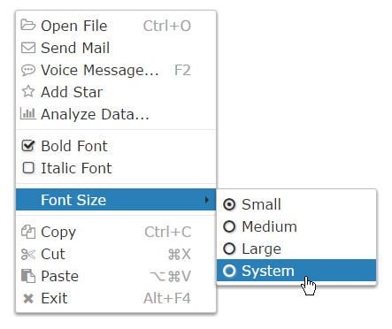

# jQuery.contextMenuCommon

[](https://www.npmjs.com/package/jquery-contextmenu-common) [](https://github.com/anseki/jquery-contextmenu-common/issues) [](package.json) [](LICENSE-MIT)

jQuery plugin to add common checkable menu items `checkbox` and `radio` and more features to jQuery.contextMenu.

[](https://anseki.github.io/jquery-contextmenu-common/)

**See <a href="https://anseki.github.io/jquery-contextmenu-common/">DEMO</a>**

A very useful jQuery plugin [jQuery.contextMenu](https://swisnl.github.io/jQuery-contextMenu/) supports `text`, `textarea`, `checkbox`, `radio`, etc., as `item.type`. Those allow you to embed form elements in the menu.  
Those may be useful in special cases, aside from whether users welcome a form that appears via right-click or not.  
But two types `checkbox` and `radio` are very popular UI many apps need, and behavior of those differs from that of common menu UI many apps have because those are embedded form elements. For example, those get a focus and tab-stop, a user can't make the focus move through to other menu items by pressing arrow keys. And also, those don't keep own state by itself, the states are cleared when the menu is reopened.

This jQuery.contextMenuCommon plugin wraps jQuery.contextMenu, and adds `checkbox` and `radio` menu types that work like common menu UI users usually use. Also, it supports sub-labels such as shortcut-keys, dynamic changing, and so on.

- `checkbox` and `radio` menu types like common menu UI are supported.
- [Font Awesome](https://fortawesome.github.io/Font-Awesome/) icons are supported.
- Disabled menu items are grayed-out like common menu UI. Included icons and mouse cursor are also controlled.
- Sub-label like displaying shortcut-keys by common menu UI is supported.

## Usage

Load jQuery.contextMenuCommon (2 files `css` and `js`) after jQuery.contextMenu.

```html
<link href="dist/fixed/jquery.contextMenu.min.css" rel="stylesheet">
<link href="dist/jquery.contextMenuCommon.min.css" rel="stylesheet">

<script src="dist/jquery.min.js"></script>
<script src="dist/jquery-ui-position.min.js"></script>
<script src="dist/fixed/jquery.contextMenu.min.js"></script>
<script src="dist/jquery.contextMenuCommon.min.js"></script>
```

Since jQuery.contextMenuCommon wraps jQuery.contextMenu, it works as jQuery.contextMenu completely, except additional features. See [jQuery.contextMenu Documentation](https://swisnl.github.io/jQuery-contextMenu/docs.html) for basic usage.

Each item object that is included in `items` in constructor options accepts [`'checkbox'`](#checkbox-type) and [`'radio'`](#radio-type) as value of `type` property.  
For example:

```js
$.contextMenuCommon({
  selector: '#trigger',
  items: {

    fontBold: {
      label: 'Bold Font',
      type: 'checkbox'
    },

    fontSize: {
      label: 'Font Size',
      items: {
        size1: {
          label: 'Small',
          type: 'radio'
        },
        size2: {
          label: 'Medium',
          type: 'radio'
        },
        size3: {
          label: 'Large',
          type: 'radio'
        }
      }
    }

  }
});
```

You can specify a `value` property of each menu item, that value is got when the menu item is in the specified state.  
There are two way to get a current value (or state).

- A value of `checked` property of each menu item is updated synchronously with the state that is changed by user or your app.
- [`value`](#methods_value) method returns a current value.

For example:

```js
var items = {

  fontWeight: {
    label: 'Bold Font',
    type: 'checkbox',
    value: ['normal', 'bold']
    // For user: "Do you want Bold Font?" -> "Yes" or "No"
    // For your app: Current value of `fontWeight` -> 'bold' or 'normal'
  },

  fontSize: {
    label: 'Font Size',
    items: {
      size1: {
        label: 'Small',
        type: 'radio',
        radiogroup: 'fontSize',
        value: '8pt'
      },
      size2: {
        label: 'Medium',
        type: 'radio',
        radiogroup: 'fontSize',
        value: '12pt',
        checked: true
      },
      size3: {
        label: 'Large',
        type: 'radio',
        radiogroup: 'fontSize',
        value: '16pt'
      }
    }
    // For user: "Please choose Font Size" -> "Small", "Medium" or "Large"
    // For your app: Current value of `fontSize` -> '8pt', '12pt' or '16pt'
  }

};

$.contextMenuCommon({selector: '#trigger', items: items});

$('#button').click(function() {
  console.log('================ Get `checked`');
  console.log('fontWeight: ' + items.fontWeight.checked);
  console.log('fontSize size1: ' + items.fontSize.items.size1.checked);
  console.log('fontSize size2: ' + items.fontSize.items.size2.checked);
  console.log('fontSize size3: ' + items.fontSize.items.size3.checked);
  console.log('================ Get value');
  var $trigger = $('#trigger');
  console.log('fontWeight: ' + $trigger.contextMenuCommon('value', 'fontWeight'));
  console.log('fontSize: ' + $trigger.contextMenuCommon('value', 'fontSize'));
});
```

## `checkbox` type

A menu item that `'checkbox'` is specified to `type` property works as `checkbox` menu item.  
For example:

```js
// In constructor options
items: {

  fontBold: {
    label: 'Bold Font',
    type: 'checkbox'
  }

}
```

The `checkbox` menu item accepts following properties:  
(All properties are optional)

### `checked`

*Alias:* `selected`  
*Type:* boolean  
*Default:* `false`

An initial or current state to indicate whether the checkbox of this menu item is checked or not.  
This is updated synchronously with the state that is changed by user or your app.

For example:

```js
// In constructor options
items: {
  item: {
    label: 'Item',
    type: 'checkbox',
    checked: true // This checkbox is checked when constructed
  }
}
```

### `value`

*Type:* Array or any  
*Default:* `[false, true]`

If something other than an array is specified, it is considered as `[false, <something>]`.  
When the checkbox of this menu item is checked, [`value`](#methods_value) method returns `value[1]` as a current value, otherwise `value[0]`.

For example:

```js
// In constructor options
items: {
  appendTo: {
    label: 'Add to document',
    type: 'checkbox',
    value: [$header, document]
  }
}
// When user checked 'Add to Document', `appendTo` value is `document`.
// When user did not check it, `appendTo` value is `$header`.
```

For example, set reversed booleans, that is, get `true` when the checkbox is not checked, and get `false` when it is checked:

```js
// In constructor options
items: {
  overwrite: { // This `overwrite` is meaningful name.
    label: 'Confirm existing file',
    type: 'checkbox',
    value: [true, false] // reversed
  }
}
```

## `radio` type

A menu item that `'radio'` is specified to `type` property works as `radio` menu item.  
For example:

```js
// In constructor options
items: {

  small: {
    label: 'Small',
    type: 'radio'
  },

  large: {
    label: 'Large',
    type: 'radio'
  }

}
```

The `radio` menu item accepts following properties:  
(All properties are optional)

### `radiogroup`

*Alias:* `radio`  
*Type:* string  
*Default:* `undefined`

A string to group the menu items and identify the group.  
In one list (i.e. one `items` object's children), items that `radiogroup` is not specified are grouped into one group.  
For example, there are five groups:

```js
// In constructor options
items: {
  a1: {
    label: 'Group A (1)',
    type: 'radio'
  },
  a2: {
    label: 'Group A (2)',
    type: 'radio'
  },
  a3: {
    label: 'Group A (3)',
    type: 'radio'
  },

  sep1: { type: 'cm_seperator' },

  b1: {
    label: 'Group B (1)',
    type: 'radio',
    radiogroup: 'groupB'
  },
  b2: {
    label: 'Group B (2)',
    type: 'radio',
    radiogroup: 'groupB'
  },
  b3: {
    label: 'Group B (3)',
    type: 'radio',
    radiogroup: 'groupB'
  },

  sep2: { type: 'cm_seperator' },

  c: {
    label: 'Group C',
    items: {
      c1: {
        label: '(1)',
        type: 'radio'
      },
      c2: {
        label: '(2)',
        type: 'radio'
      },
      c3: {
        label: '(3)',
        type: 'radio'
      }
    }
  },

  sep3: { type: 'cm_seperator' },

  de: {
    label: 'Group D and E',
    items: {
      d1: {
        label: 'Group D (1)',
        type: 'radio'
      },
      d2: {
        label: 'Group D (2)',
        type: 'radio'
      },
      d3: {
        label: 'Group D (3)',
        type: 'radio'
      },

      sep4: { type: 'cm_seperator' },

      e1: {
        label: 'Group E (1)',
        type: 'radio',
        radiogroup: 'groupE'
      },
      e2: {
        label: 'Group E (2)',
        type: 'radio',
        radiogroup: 'groupE'
      },
      e3: {
        label: 'Group E (3)',
        type: 'radio',
        radiogroup: 'groupE'
      }
    }
  }
}
```

### `checked`

*Alias:* `selected`  
*Type:* boolean  
*Default:* first item in a group is `true`, others are `false`

An initial or current state to indicate whether the radio of this menu item is checked or not.  
This is updated synchronously with the state that is changed by user or your app.  
Only a last menu item `true` is specified in a group is checked. By default, a first menu item in a group is checked.

For example:

```js
// In constructor options
items: {
  item1: {
    label: 'Item 1',
    type: 'radio'
  },
  item2: {
    label: 'Item 2',
    type: 'radio',
    checked: true // This radio is checked when constructed
  },
  item3: {
    label: 'Item 3',
    type: 'radio'
  }
}
```

### `value`

*Type:* any  
*Default:* zero-based index number in a group

When the radio of this menu item is checked, [`value`](#methods_value) method returns `value` as a current value of a group that includes this menu item.  
In other words, a current value of a group is a `value` of checked menu item in the group.

For example:

```js
// In constructor options
items: {
  a: {
    label: 'Item A',
    type: 'radio',
    value: 'A' // 'A' is returned when this item is checked.
  },
  b: {
    label: 'Item B',
    type: 'radio' // `1` (index) is returned when this item is checked.
  },
  c: {
    label: 'Item C',
    type: 'radio',
    value: 'C' // 'C' is returned when this item is checked.
  }
}
```

## Methods

### <a name="methods_value"></a>`value`

```js
currentOrNewValue = $trigger.contextMenuCommon('value', itemKeyOrRadioGroup[, newValue])
```

Return a current value of the target. If `newValue` is passed, update a value of the target before return.  
The target is a menu item or a group of `radio` menu items `itemKeyOrRadioGroup` indicates. `itemKeyOrRadioGroup` is a key of an `items` object, or a string as [`radiogroup`](#radiogroup). It is discriminated automatically.  
A returned value differs depending on `checked` state of the target menu item or menu items in the target group.  
If `itemKeyOrRadioGroup` indicates a `radio` menu item, a current value of a group that includes that menu item is returned (i.e. it is considered as that `itemKeyOrRadioGroup` indicates the group). Therefore, note that a returned value might be not `value` of the target menu item. (Because a value of a group is a `value` of checked menu item in the group. And another item in that group might be checked.)  
Also, `newValue` is a value in `value` array of the target `checkbox` menu item or `value` of any of `radio` menu items in the target group.

For example:

```js
$.contextMenuCommon({
  selector: '#trigger',
  items: {

    fontWeight: {
      label: 'Bold Font',
      type: 'checkbox',
      value: ['normal', 'bold']
    },

    fontSize: {
      label: 'Font Size',
      items: {
        size1: {
          label: 'Small',
          type: 'radio',
          radiogroup: 'fontSize',
          value: '8pt'
        },
        size2: {
          label: 'Medium',
          type: 'radio',
          radiogroup: 'fontSize',
          value: '12pt'
        },
        size3: {
          label: 'Large',
          type: 'radio',
          radiogroup: 'fontSize',
          value: '16pt'
        }
      }
    }

  }
});

var $trigger = $('#trigger');

$('#button-get-values').click(function() {
  console.log('fontWeight: ' + $trigger.contextMenuCommon('value', 'fontWeight'));
  console.log('fontSize: ' + $trigger.contextMenuCommon('value', 'fontSize'));
});

$('#button-set-weight').click(function() {
  $trigger.contextMenuCommon('value', 'fontWeight', 'bold');
});

$('#button-set-size').click(function() {
  $trigger.contextMenuCommon('value', 'fontSize', '12pt');
});
```

### `click`

```js
$trigger = $trigger.contextMenuCommon('click', itemKey)
```

Emulate a click operation by user.  
The state of checkbox or radio, `checked` and `value` property are updated.  
This is mainly used to toggle the checkbox.

For example, the following two codes work same:

```js
$.contextMenuCommon({
  selector: '#trigger',
  items: {

    fontWeight: {
      label: 'Bold Font',
      type: 'checkbox',
      value: ['normal', 'bold']
    },

    fontSize: {
      label: 'Font Size',
      items: {
        size1: {
          label: 'Small',
          type: 'radio',
          radiogroup: 'fontSize',
          value: '8pt'
        },
        size2: {
          label: 'Medium',
          type: 'radio',
          radiogroup: 'fontSize',
          value: '12pt'
        },
        size3: {
          label: 'Large',
          type: 'radio',
          radiogroup: 'fontSize',
          value: '16pt'
        }
      }
    }

  }
});

var $trigger = $('#trigger');

$trigger.contextMenuCommon('click', 'fontWeight');
$trigger.contextMenuCommon('click', 'size2');
```

```js
// ... same to above

var $trigger = $('#trigger');

var currentValue = $trigger.contextMenuCommon('value', 'fontWeight');
$trigger.contextMenuCommon('value', 'fontWeight',
  currentValue === 'normal' ? 'bold' : 'normal');
$trigger.contextMenuCommon('value', 'fontSize', '12pt');
```

## `label`

*Alias:* `name`  
*Type:* string, jQuery, DOM or Array

A string that is specified to `label` property of a menu item is shown to user on the menu item.  
If an array is specified, the second string is shown as sub-label that is positioned to the right of the label. It is usually used to indicate a shortcut-keys of the command.  
For example:

```js
// In constructor options
items: {
  a: {
    label: 'Create New', // no sub-label
    icon: 'add'
  },
  b: {
    label: ['Open File...', 'Ctrl+O'],
    icon: 'fa fa-folder-open-o' // Icon by Font Awesome
  },
  c: {
    label: ['Save', 'Ctrl+S'],
    icon: 'fa fa-floppy-o' // Icon by Font Awesome
  },
  d: {
    label: ['Save As...', 'Ctrl+Shift+S']
  },
  e: {
    label: ['Quit', '\u2318Q'], // symbol for OS X
    icon: 'quit'
  }
}
```

Note that the shortcut-keys are not a access-keys, and jQuery.contextMenuCommon only shows it. And your app has to handle those key events, and so on if your app supports shortcut-keys, because shortcut-keys have to work without depending on the menu.

Also, you can specify a jQuery object or a DOM element instead of a string to a label and sub-label. It is used to decorate the label or sub-label, change those dynamically, or customize those more, or you can do anything you want. Note that you can also break a layout of the menu easily.  
For example:

```js
// In constructor options
items: {
  a: {
    label: $('<span>Open <strong>My</strong> File...</span>')
  },
  b: {
    label: ['Save', $('<span>Ctrl+<span style="color: blue;">S</span></span>')]
  }
}
```

For example, change dynamically, and add animation:

```js
var label = $('<span>Download Data File</span>'),
  item, rate, span, isLoading;

function progress() {
  if (!item) {
    item = label.parent().css({
      backgroundImage: 'url(\'data:image/svg+xml;utf8,' +
        '%3Csvg%20xmlns%3D%22http%3A%2F%2Fwww.w3.org%2F2000%2Fsvg%22%20viewBox%3D%220' +
        '%200%2025%2025%22%20width%3D%2225%22%20height%3D%2225%22%3E%3Crect%20x%3D%22' +
        '0%22%20y%3D%220%22%20width%3D%22100%25%22%20height%3D%22100%25%22%20fill%3D' +
        '%22rgba%28168%2C241%2C163%2C0.8%29%22%2F%3E%3C%2Fsvg%3E\')',
      // Chrome does not support adjusting background-size.
      // backgroundSize: '0 100%',
      backgroundSize: '0',
      backgroundRepeat: 'repeat-y'
    });
    rate = span = 0;
  }
  if ((rate += span) < 100) {
    span = Math.floor(Math.random() * 26) + 5; // [5, 30]
    if (span > 100 - rate) { span = 100 - rate; }
    item.animate({backgroundSize: rate + span + '%'},
      Math.floor(Math.random() * 2501) + 500, // [500, 3000]
      progress);
  } else {
    isLoading = false;
    rate = span = 0;
    label.text('Download Next File');
  }
}

$.contextMenuCommon({
  selector: '#trigger',
  items: {
    download: {
      label: label,
      icon: 'fa fa-download',
      callback: function() {
        if (isLoading) {
          isLoading = false;
          label.text('Restart Download');
          item.stop();
        } else {
          isLoading = true;
          label.text('Stop Download');
          if (rate === 0 && span === 0) { item.css('backgroundSize', '0'); } // next
          progress();
        }
        return false;
      }
    }
  }
});
```

## `icon`

`icon` property accepts class names of basic icons, and class names of [Font Awesome](https://fortawesome.github.io/Font-Awesome/) icons such as `fa fa-folder-open-o` also.  
For example:

```js
// In constructor options
items: {
  a: {
    label: 'Basic Icon',
    icon: 'edit'
  },
  b: {
    label: 'Font Awesome Icon',
    icon: 'fa fa-github-alt'
    // http://fortawesome.github.io/Font-Awesome/icon/github-alt/
  }
}
```
